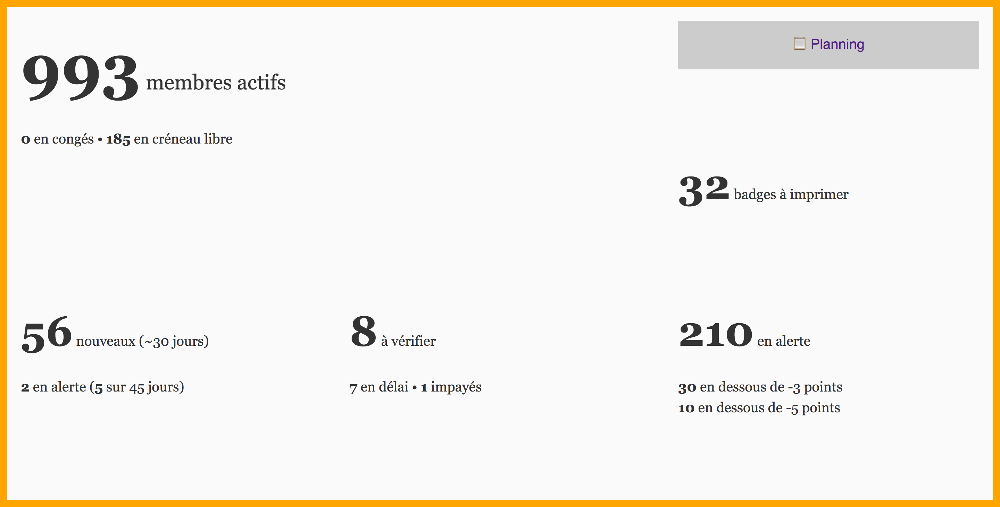
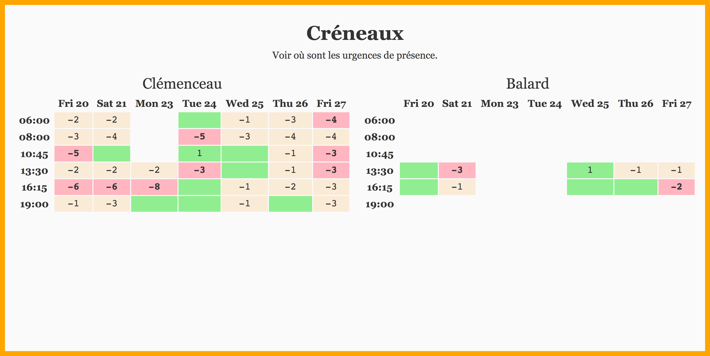

# `food-coops-dashboards`

> Des tableaux de bord pour supermarchés coopératifs afin d'y voir plus clair au jour le jour.

# Nature des tableaux de bord

## Adhérent·e·s

**Intention** : savoir à quoi ressemble la dynamique coopérative.



## Planning

**Intention** : voir où sont les urgences de présence.



## Créneaux

**Intention** : voir les créneaux qui gagneraient à accueillir davantage de participant·e·s.

# Déploiement

```bash
$ npm run deploy
```

# Licence

[CC0 1.0 Universal](LICENSE)
